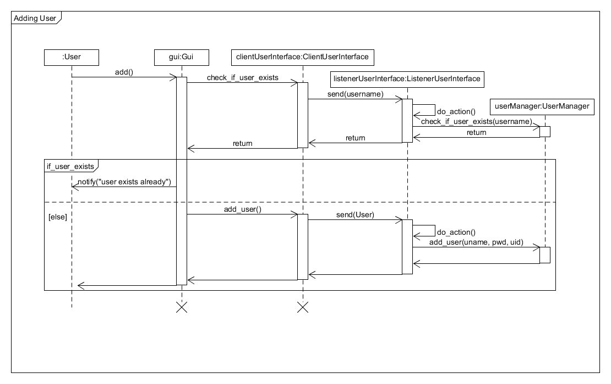

# SMOCK
**Sm**art C**o**mputer Lo**ck**

## What is SMOCK?

Smock is a device capable of locking or unlocking your computer, depending on whether you are at your workplace or not. The device is also able to distinguish between different users of a computer and to log in the corresponding user.

This functionality should offer many advantages for the user. First, it is no longer necessary to remember a long password and it is also not necessary to type in this password. This simplifies and speeds up the process of logging in.

In addition to that, the computer logs itself off automatically, when the user moves away and secures his privacy. 

Another advantage is the working environment where different users work on the same computer but with different accounts. SMOCK enables the automatic logging in of the user who currently needs the computer.

Finally remains the possibility to log in manually by entering the user name, if needed, and the password.

## Requirements

### Functional requirements

From the above mentioned goals, we deduced six important use cases.


The first three use cases are the mentioned goals. These use cases are all initiated by the user and executed by the SMOCK device. 

So that the device can provide this functionality, the next three use cases are needed. The user must have the possibility to register himself, so the device can identify him as user from the system. The device also needs to get the information needed by the system to log in. Furthermore, the user needs the opportunity to edit his registered setting in case he made a mistake or changed his data in the system. Finally, the user must have the opportunity to delete all his data from the system.

### Non-functional requirements

To limit the requirements, we had to set different functional requirements.

First, should the system can recognize and differentiate multiple users. If the device would not fulfill this, the privacy of every user could not be guaranteed.

Another very important requirement is the integrity of the system. The device should be *small and easy to plug or unplug*. When connecting the device to another computer, this device must not can read the user data of the other computer.

These two requirements are the most important. If these requirements are not met, the system does not work and must not be used!

In addition, there are a few little less important requirements.

The first one is the availability. When the computer runs the system should also work and be active, so that the user does not need to log in manually.

Moreover, the efficiency is important. Additional to the host log in/out time should hardly pass time. The user should not be fast by logging in manually then the device is. Furthermore, the device should not use up too much energy.

Finally, we have decided that the system should work on two different operating system. Firstly windows 10 and secondly ubuntu 16.04 should be supported.

The User must install Python 3.5, otherwise he is not able to use the scripts.

All system requirements, functional and non-functional, are shown in the image below:


## Components

Thinking about different way to identify users we have decided to use RFID. RFID has multiple advantages for our system.

First, the user just needs to carry around the RFID tag. This tag can be very small and they are available in many different variants. This makes it easy to carry them.

RFID tags are also common in many companies as key cards. So many of the employee already have an RFID Tag.

Finally, the tags can easily be identified and be distinguished from other tags.

To communicate with the tag, we need an RFID Reader. The reader has the task to read the ID from the tag. 

To control the reader and to communicate with the computer we use a usb-capable micro controller. The micro controller handles the event when a new card is read by the RFID reader, verifies the user and logs him in. The same way works with logging off from the user.


## Software Structure

### Device

The Software of the device is separated into two different parts. The first one which controls the MFRC522 RFID Reader mainly consists of one class, the <a href="https://iot-lab-minden.github.io/smock/device/html/classrfid__reader_1_1MFRC522.html">MFRC522</a> class.

This class uses the SPI module provided by the Energia libraries to communicate with the host. The class hold the currently available uid in a UID struct. This struct contains an array of bytes that holds the ID. The struct also holds the length of the UID array.

The <a href="https://iot-lab-minden.github.io/smock/device/html/classrfid__reader_1_1MFRC522.html.html">MFRC522</a> class offers the needed functions to setup and communicate with the reader. To handle different error values a <a href="https://iot-lab-minden.github.io/smock/device/html/namespacerfid__reader.html#ad77c7f5b5f680bb2cbb180387c606c24">StatusCode</a> enumeration is used.

The second part controls the usb communication. The general communication between the host and the device is realized with a serial interface. The device is represented by the <a href="https://iot-lab-minden.github.io/smock/device/html/classusbdevice_1_1USBSerialDevice.html">USBSerialDevice</a>. It contains a *tUSBCDCDevice* which is responsible for the serial communication. The *tUSBCDCDevice* type is provided by the usb library from Texas Instruments and it is used to register the callbacks to handle different usb events. There are three callbacks needed for the serial communication. The first one handles the general usb events like connecting or disconnecting the usb connection, the second one handles the event when data was received and the third one handles the event when data was transmitted.

The received data is written into a receive buffer and the data that should be transmitted needs to be written in a transmit buffer.

To lock or unlock the host it is necessary to simulate a keyboard device. For this is the <a href="https://iot-lab-minden.github.io/smock/device/html/classusbdevice_1_1USBKeyboardDevice.html">USBKeyboardDevice</a> class used. The class handles events received from the host and provides methods to send keys. The event handler callback method is registered with a *tUSBHIDKeyboardDevice* which is like the *tUSBCDCDevice* responsible for the connection.

Since we are connecting two usb devices to the host via one usb port we need a composite device to combine them. The device is represented by the <a href="https://iot-lab-minden.github.io/smock/device/html/classusbdevice_1_1USBCompDevice.html">USBCompDevice</a> class. This class holds both structures of the devices which a responsible for the connection (the *tUSBHIDKeyboardDevice* and the *tUSBCDCDevice*). Events send from the host can be the releasing or pressing of special keys.

Because this class takes over the registration at the host the device also contains a descriptor data array that holds the information needed by the host. The connection is like the other devices handled by a structure provided by the usb library. This tUSBCompositeDevice struct also registers an event handler for default usb events like connecting or disconnecting.


### Host

The software of the host is separated in two different scripts. The first script is the service script and the second script is the user script.

The service script is for communicating with the serial device. The class that is talking to the serial device is the <a href="https://iot-lab-minden.github.io/smock/controller/html/classserial_manager_1_1_serial_manager.html">SerialManager</a>. This class receives the messages from the serial device as well as writes messages to the serial device. When the SerialManager receives a message it forwards the message to the QueueManager.

The <a href="https://iot-lab-minden.github.io/smock/controller/html/classqueue_manager_1_1_queue_manager.html">QueueManager</a> puts the message, that it gets into separate queues, depending on what message the QueueManager got. When another class asks to read a message from a queue, the class must tell the QueueManager which command he is looking for. The QueueManager will look into the correct queue and returns the message, when a message exists.

A <a href="https://iot-lab-minden.github.io/smock/controller/html/classmessage_1_1_message.html">Message</a> contains a command code and the text. The command code is useful for separating the messages and being aware, what the serial device wants. The text is the information of message.

The <a href="https://iot-lab-minden.github.io/smock/controller/html/classtask_manager_1_1_task_manager.html">TaskManager</a> reads if there are any messages in the QueueManager. When the TaskManager reads a message, it responds to this message proceeds according to what the command code says.

The <a href="https://iot-lab-minden.github.io/smock/controller/html/classuser_manager_1_1_user_manager.html">UserManager</a> is responsible for loading the already existing users from files and managing them. This means adding a new User, editing them or delete a User. The <a href="https://iot-lab-minden.github.io/smock/controller/html/classuser_1_1_user.html">User</a> has the attributes user name, password and uid.

The last class of the service script is the <a href="https://iot-lab-minden.github.io/smock/controller/html/classlistener_user_interface_1_1_listener_user_interface.html">ListenerUserInterface</a>. This class is the interface to the user script and uses ipv4 to communicate.

The user script is for the user. This opens a Gui that the user can use to add new User or edit/delete User. The <a href="https://iot-lab-minden.github.io/smock/gui/html/classgui_1_1_gui.html">Gui</a> has a main window and the different methods to answer the events that are triggered by pressing buttons. The user Script connects to the open port of the ListenerUserInterface of the service script. This happens in the class <a href="https://iot-lab-minden.github.io/smock/gui/html/classclient_user_interface_1_1_client_user_interface.html">ClientUserInterface</a>. The ClientUserInterface has also the task to pass changes that are made by a user to the service script.


## Software processes

### Device

#### Main

The main component of the device software is realized with a <a href="https://iot-lab-minden.github.io/smock/device/html/main_8cpp.html#ae9c42c594bb848c81ace2ff29f64dc89">state machine</a>.


After starting the micro controller goes into the *START* state. All events that come in, whether they come from the RFID reader or via the serial port, are discarded, except for the <a href="https://iot-lab-minden.github.io/smock/device/html/main_8cpp.html#a887ec76db4f4aa156c159988294a5dc7">OS_SYSTEM</a> event from the host. This message contains information about the operating system and the number of users registered to the software. Without this information the log in or off won't work because there are different schedules needed for a different number of users or different operating systems.

After receiving the needed information, the host goes in the *LOCKED* state. This state is only left when a card is read by the RFID reader. The read Uid from the tag is stored as currentUid. The device sends over the serial interface a request for the password and optional the user name matching to the Uid.

Then the system goes in the state *WAIT_FOR_PW*. In this state the device waits for the answer of the host. There are two different way the host can answer. The first opportunity is that the device receives as <a href="https://iot-lab-minden.github.io/smock/device/html/main_8cpp.html#a887ec76db4f4aa156c159988294a5dc7">HOST_STATUS</a> message. This message indicates that the host is already logged in. In this case a user has unlocked the host manually and the device should not sign in the new user. The system goes back to the *LOCKED* state in that case and resets the currentUid to a default value.

The second possible answer is a message containing the username and optional the password. In this case the micro controller uses the information to log in the user using the simulated keyboard. The following state in this case is the *UNLOCKED* state.

The device stays in this state until the card is gone, or another card is read. There is a counter used which is increased when no or a different card is read. If the counter reaches a certain value, the card is identified as lost. In that case the system resets the currentUid to the default value and and requests the host state via the serial interface. After that the host goes to the *VALIDATE_HOST_LOCKED_STATE*. The missing card counter is reset to zero when the card is detected again. The use of a counter is necessary because the reader does not always detect the card.

In the *VALIDATE_HOST_LOCKED_STATE* the device waits for the answer of the host to the status request. If the host returns that he is already locked out the state of the device is simply changed to *LOCKED*. Otherwise the device locks the host using the simulated keyboard and goes in the *LOCKED* state afterwards.

In every state are unexpected events discarded except for a few certain requests received via the serial interface.

The first one is the information that the number of registered users has changed. In this case the host sends a <a href="https://iot-lab-minden.github.io/smock/device/html/main_8cpp.html#a887ec76db4f4aa156c159988294a5dc7">USER_QUANTITY</a> code followed by 1 if there is only one user registered and a 2 otherwise.

The second one is when the operating system information is send again. When this happens the device stores updates of the operating system and user quantity information.

Finally, the currently read UID can be requested from the host to connect it to a user. The device returns the value of the currentUid if it does not hold the default value. In that case is an empty uid returned.

#### Serial interface

The described events from the serial interface are received by the <a href="https://iot-lab-minden.github.io/smock/device/html/classusbdevice_1_1USBSerialDevice.html">USBSerialDevice</a> class. A interrupt executes the *RxHandler*, defined in the main script, when new data is available. This method writes new data into the *receiveBuffer*. There are two receive buffers needed in this class because the first one, the *g_sRxBuffer* is automatically filled by the usb library, because it is a *tUSBBuffer* and was initialized with the *USBBufferInit()* function. The second receive buffer is for the use of the user. This buffer is handled as a queue.

So the new received data in the *g_sRxBuffer* is added to the end of the *receiveBuffer* in the <a href="https://iot-lab-minden.github.io/smock/device/html/classusbdevice_1_1USBSerialDevice.html#acca2b3c4990e877940768e3ee02e9400">USBSerialDevice.readBuffer()</a> function. In this function is also a counter of all received data incremented.

In the main method reads the head of the queue. If the queue is empty, an empty value is returned. The read byte indicates whether and which event was received.

To send data to the host the <a href="https://iot-lab-minden.github.io/smock/device/html/classusbdevice_1_1USBSerialDevice.html">USBSerialDevice</a> class provides a write method which takes a data array and the length of the data as parameters. This function calls the *USBBufferWrite()* function from the usb library to write the data in the *g_sTxBuffer*. This buffer is built like the *g_sRxBuffer* with the difference the the receive Buffer was built with *USBDCDCPacketRead* and the transmit buffer with *USBDCDCPacketWrite*. The data written in the transmit buffer is automatically send to the usb connection.

### Keyboard device

The keyboard device is a human interface device. The <a href="https://iot-lab-minden.github.io/smock/device/html/classusbdevice_1_1USBKeyboardDevice.html">USBKeyboardDevice</a> provides two methods to press keys. The first on is the <a href="https://iot-lab-minden.github.io/smock/device/html/classusbdevice_1_1USBKeyboardDevice.html#ac71a205e6fa9aef43efeb89bad6be6b3">USBKeyboardDevice.USBWriteString()</a> function that writes the given data by calling <a href="https://iot-lab-minden.github.io/smock/device/html/classusbdevice_1_1USBKeyboardDevice.html#a6e9ec2037f7fe2a81f8fab0d9f2699c1">USBKeyboardDevice.USBKeyboardUpdate()</a> function press and release the key for every given char.

Before pressing the key the usage code of the given char is gotten by calling the <a href="https://iot-lab-minden.github.io/smock/device/html/classusbdevice_1_1USBKeyboardDevice.html#aee4901b0d53c1fdb8288fef509c0a7d1">USBKeyboardDevice.GetUsageCode()</a> method.

The second method <a href="https://iot-lab-minden.github.io/smock/device/html/classusbdevice_1_1USBKeyboardDevice.html#a7eb69eed34b31f8da978e05f38e7d805">USBKeyboardDevice.USBPressKeyComnination()</a> takes a modifier byte for the special keys and a string of keys the user wants to press at the same time. The function simply presses every key using the *USBDHIDKeyboardKeyStateChange()* function. Only when all keys were pressed they are released.

### RFID reader

The RFID reader is controlled with the <a href="https://iot-lab-minden.github.io/smock/device/html/classrfid__reader_1_1_m_f_r_c522.html">MFRC522</a> class. This class communicates with the reader over SPI. For this the Energia SPI library is used. The reader provides methods to ask if a new card is detected by the reader and to read the uid from them. In the <a href="https://iot-lab-minden.github.io/smock/device/html/classrfid__reader_1_1MFRC522.html#aedc2727258a1e3bf7ef2f019e69c1cbf">MRFC522.isNewCardPresent()</a> function is a request send to the reader and when a <a href="https://iot-lab-minden.github.io/smock/device/html/namespacerfid__reader.html#ad77c7f5b5f680bb2cbb180387c606c24">STATUS_OK</a> or <a href="https://iot-lab-minden.github.io/smock/device/html/namespacerfid__reader.html#ad77c7f5b5f680bb2cbb180387c606c24">STATUS_COLLISION</a> was returned a new card is present. After that in the main method is the uid read by calling <a href="https://iot-lab-minden.github.io/smock/device/html/classrfid__reader_1_1MFRC522.html#a1ce8c2c1a120db5e6468a3258df20894">readCardSerial()</a>.

### Host

#### Service Script

At first the service script is started. This initializes the <a href="https://iot-lab-minden.github.io/smock/controller/html/classqueue_manager_1_1_queue_manager.html">QueueManager</a>, the <a href="https://iot-lab-minden.github.io/smock/controller/html/classtask_manager_1_1_task_manager.html">UserManager</a>, the <a href="https://iot-lab-minden.github.io/smock/controller/html/classserial_manager_1_1_serial_manager.html">SerialManager</a>, the <a href="https://iot-lab-minden.github.io/smock/controller/html/classlistener_user_interface_1_1_listener_user_interface.html">ListenerUserInterface</a> and the <a href="https://iot-lab-minden.github.io/smock/controller/html/classtask_manager_1_1_task_manager.html">TaskManager</a>. Then there start three different threads. 

The first thread opens the port of the ListenerUserInterface and waits for incoming connections from the user script. When a user connects to the port, the user will be stored in a client list of the ListenerUserInterface.

The next thread is calling a function from the SerialManager. This function is called <a href="https://iot-lab-minden.github.io/smock/controller/html/classserial_manager_1_1_serial_manager.html#af3b68b0396e8387c6930f00e3d49364b">SerialManager.fill_queue()</a> and waits for recieving bytes from the serial device. The messages will be stored as <a href="https://iot-lab-minden.github.io/smock/controller/html/classmessage_1_1_message.html">Message</a> in the queue with the function <a href="https://iot-lab-minden.github.io/smock/controller/html/classqueue_manager_1_1_queue_manager.html#acd24aed3104688ba45e58aab38149114">QueueManager.write_queue()</a>.

The last thread calls the function <a href="https://iot-lab-minden.github.io/smock/controller/html/classtask_manager_1_1_task_manager.html#ae24df378d896e8446e08c8e6d53e1221">TaskManager.read_tasks()</a>. Depending on what command code the TaskManager reads from the queue it calls the functions <a href="https://iot-lab-minden.github.io/smock/controller/html/classtask_manager_1_1_task_manager.html#a2bbf0eeebab21963240c978ca078062e">TaskManager.send_password_to_controller()</a>, *TaskManager.send_computer_status()* or *TaskManager.update_add_window()*.

After that three threads the function <a href="https://iot-lab-minden.github.io/smock/controller/html/classlistener_user_interface_1_1_listener_user_interface.html#a11f2e26487c67767df066ff26a512032">ListenerUserInterface.check_for_new_msg()</a> is called in an endless loop.

#### User Script

After the service script is started, the user script can be started. At first the <a href="https://iot-lab-minden.github.io/smock/gui/html/classclient_user_interface_1_1_client_user_interface.html">ClientUserInterface</a> and the <a href="https://iot-lab-minden.github.io/smock/gui/html/classgui_1_1_gui.html">Gui</a> are initialized. Then a thread is started. It calls the function <a href="https://iot-lab-minden.github.io/smock/gui/html/classclient_user_interface_1_1_client_user_interface.html#a6b31f0775ec89901c75c8b9534e6eee0">ClientUserInterface.polling()</a>. After this thread is called the gui will be started. Now the user has a few possibillities to continue.

##### Add new User

The first is to add a new <a href="https://iot-lab-minden.github.io/smock/controller/html/classuser_1_1_user.html">User</a>. Therefore the User presses the button and then the function *Gui.add()* is called. This will open a new window, where the user can type in the account information of a user. The user can also hold a new RFID tag at the reader and connect this tag to the user account. When the user filled in all information, then at first the function <a href="https://iot-lab-minden.github.io/smock/gui/html/classclient_user_interface_1_1_client_user_interface.html#a8227a82a8f91a2d3ea6ea3b8dad2ffdf">ClientUserInterface.check_if_user_exists()</a> is called so there won't be a duplicate user. The service script checks if the user already exists and if not, then "False" is returned. Then the user will be added to the UserManager in the service script. At first the <a href="https://iot-lab-minden.github.io/smock/gui/html/classclient_user_interface_1_1_client_user_interface.html#a024e4a19d671a9ef94a86453ed1a9641">ClientUserInterface.add_user()</a> is called. This will pass the information to the service script. There it will call the function <a href="https://iot-lab-minden.github.io/smock/controller/html/classuser_manager_1_1_user_manager.html#ac539b9843ebdcd50acf577a29e71c624">UserManager.add_user()</a>.



##### Edit User

If the user wants to edit an account, the user must select a user from the list and then press the "Edit" button. This calls the function *Gui.edit()*. Another window is popping up. The user can change the username and password. He is not able to change the uid. After the user changed the username and password. That information is send to the ListenerUserInterface. There is the function <a href="https://iot-lab-minden.github.io/smock/controller/html/classuser_manager_1_1_user_manager.html#a02119e9b77d780592d389afdb8bb3c83">UserManager.edit_user()</a> called, that function edits the User in the UserManager. Then the edit window closes.


##### Delete User

To delete a User. The user just must select one User of the listbox in the main window and presses the button "Delete". Then the function *Gui.delete()* is called. This sends the information together with the index of the user to the service script. There the function <a href="https://iot-lab-minden.github.io/smock/controller/html/classuser_manager_1_1_user_manager.html#a7ef21abed1f8e13558d827f3f498d4c1">UserManager.delete_user()</a> is called.


The user is also able to press a button to check if the device is connected or not. then the function *Gui.find_controller()* is called. Then the ListenerUserInterface calls the function <a href="https://iot-lab-minden.github.io/smock/controller/html/classserial_manager_1_1_serial_manager.html#a8a90050aa39382eb45eab44160d7f815">SerialManager.find_serial_device()</a>. After that the ListenerUserInterface returns if the serial device was found or not.

### Activity Diagrams

This diagram shows different communication protocols between host and user. Switch user works like log in except there is user name and password transferred and not only the password.

#### unlock


#### lock


#### register


## Setup

### Device

Connect the pins of the Tiva C Launchpad and the MFRC522 like shown below in the table:

| Tiva C pin | MFRC522 pin |
| ---------- | ----------- |
| PA2        | SCK         |
| PA3        | SDA         |
| PA4        | MISO        |
| PA5        | MOSI        |
| PA6        | RST         |


### Windows

To set up the program for windows python needs to be installed on the host. Python version 3.5 or above is needed but version 3.7 is recommended.

For the communication with the host the main.py needs to be started. For every user that is locked in must run an instance of the userScript.py so that the main program can check whether the user is logged in or not.

For the use of the multiple user option it is also needed to change the registry to log in by entering the user name and the password, not only by entering the password.

1. Press Win+R keys on your keyboard, the "Run" dialog will appear

2. Type **regedit** and press Enter

3. Enter the following key:

   ````
   HKEY_LOCAL_MACHINE\SOFTWARE\Microsoft\Windows\CurrentVersion\Policies\System
   ````

4. Edit the *dontdisplaylastusername* value from 0 to 1

5. Press *OK*

### Ubuntu

To run the program on ubuntu you need to run the service script main.py as a root, otherwise it can't open the serial port. On the other hand, the userSript_ubuntu.py needs to be run as user, because if not the is_locked function will not work.

To setup the system to login by entering user name and password you need to do the following steps:

````bash
sudo mkdir -p /etc/lightdm/lightdm.conf.d

sudo gedit /etc/lightdm/lightdm.conf.d/10-ubuntu.conf

Enter the following text:

[SeatDefaults]
user-session=ubuntu
greeter-show-manual-login=true
greeter-hide-users=true
allow-guest=false
````

### User Manual

First you connect the smock device to the computer. 
Then you start the service script.
After that you can open the user script.

The Gui looks like this.


Then you have a few options. If you want to add a new user, you have to press the "Add" button.
Then a new window comes up.


You must type in your username and password. To recognize an uid, you have to hold your RFID tag on the smock device and then press the button "Refresh uid".
When the uid is recognized you can press the button "OK" and the user will be added to your list.

After that you can edit the user. Therefore you have to select a user of the list and press the button "edit".
Then a new window comes up.


Then you must type in a new username and password. You are not able to change the uid, when you edit the user.

To delete a user, you simply select the user you want to add and delete him.

After you add the user, you can use the system. To start using the system as single user, you just have to log out of the computer with *win + L*. 
Then you can put your tag onto the device and it will keep you logged in as long as the card is on the serial device. If you take away the tag, you will automatically log out.

If you want to use the system as multiple user, you have to first read the setup and set the regedit entries. If you have done that, you have to lock out of the system with *ctrl + alt + del* and then click on the change user button. It is important that you can see the entries for username and password. If you see the entries, you can put your tags onto the device and you will log into the correct device. 

## Conclusion

Taking everything into account we reached all our defined use cases. Advantage of the system is that it can be upgrade without putting too much work in it.

To run it on other versions of windows or ubuntu or on slightly different system the only thing that changes is how the script is started or the way the script check whether the computer is locked. Maybe it is also needed to change some short cuts the micro controller uses.

By changing the reader class on micro controller another RFID reader can be connected to the board. This can be useful to generate a higher distance in which the system detects a card or to use a different RFID-protocol.

## Code Documentation

__Host__

* <a href="https://iot-lab-minden.github.io/smock/gui/html/index.html">Gui</a>
* <a href="https://iot-lab-minden.github.io/smock/controller/html/index.html">Service</a>

**Device**

* <a href="https://iot-lab-minden.github.io/smock/device/html/index.html">Main</a>

## Parts list

* <a href="http://www.ti.com/tool/EK-TM4C123GXL">Tiva C Launchpad</a>
  * <a href="http://www.ti.com/lit/ug/spmu297d/spmu297d.pdf">USB Library</a>
* <a href="https://www.nxp.com/docs/en/data-sheet/MFRC522.pdf"> MFRC522</a>

